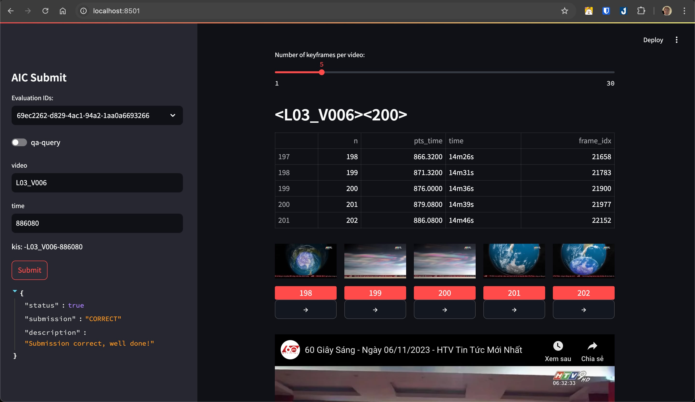

# How to use: 

#### data: uploaded Keyframes_L01 -> Keyframes_L03
#### requirements.txt: updating

> streamlit run main.py

## User Interface Preview

####  [Demo Link](https://youtu.be/NfWW7_T-2Ik?si=OrRdR04h6z974WMF)

## What do we have? 👀
- Optimized streamlit's multiselect via library source.
- Video Searching 🔍.
- Answer Submitting 😻.